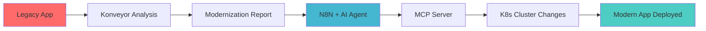
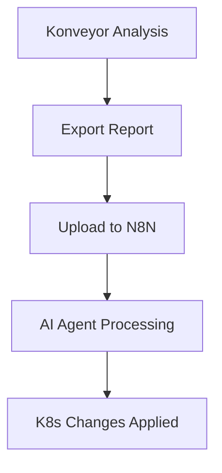
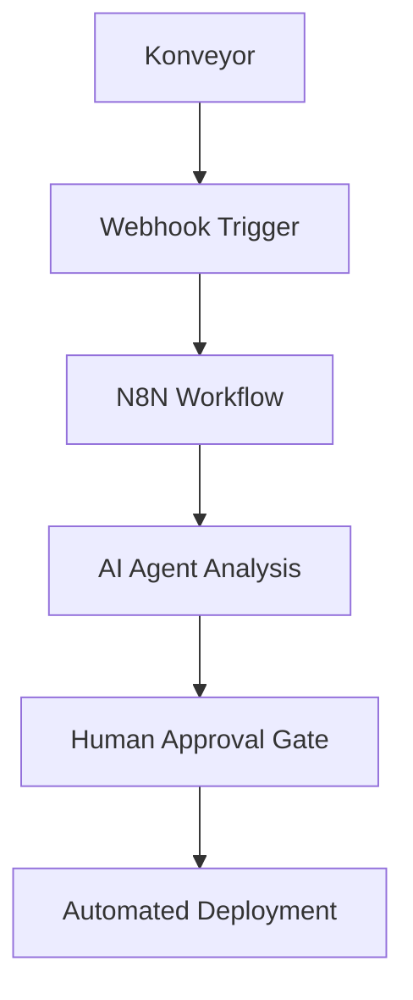
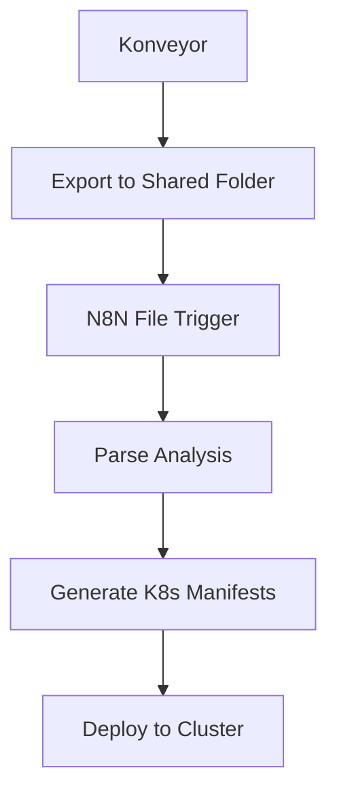
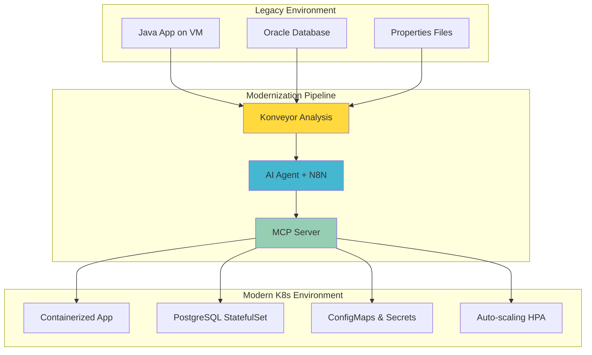

# Konveyor N8N Integration

**Automated Legacy Modernization Pipeline**: Konveyor analyzes your legacy applications → AI agent interprets the recommendations → Kubernetes cluster gets automatically updated with modern deployments.

## 🎯 Vision: Automated Modernization Pipeline

This project creates an end-to-end AI-powered modernization workflow that takes Konveyor's legacy application analysis and automatically implements the recommended changes in your Kubernetes cluster.

### The Complete Flow


### Architecture Components
- **🔍 Konveyor**: Analyzes legacy applications and provides modernization roadmaps
- **🤖 AI Agent**: Interprets Konveyor output using Gemini/OpenAI and plans implementation
- **🔧 MCP Server**: Exposes Kubernetes API via Model Context Protocol
- **⚡ N8N**: Orchestrates the workflow with human approval gates
- **☸️ Kubernetes**: Target platform for modernized applications

## 🚀 What This Pipeline Can Do

### Konveyor Input Examples:
- "This Java app should be containerized with OpenJDK 17"
- "Database needs PostgreSQL migration on K8s"
- "Legacy config files should become ConfigMaps"
- "Application requires horizontal pod autoscaling"

### AI Agent Actions:
- ✅ **Generate Dockerfiles** for containerization
- ✅ **Create K8s Deployments** with proper resource limits
- ✅ **Deploy Databases** with persistent storage
- ✅ **Configure Networking** (Services, Ingress)
- ✅ **Set up ConfigMaps/Secrets** from legacy configs
- ✅ **Implement Auto-scaling** (HPA/VPA)
- ✅ **Apply Security Policies** and RBAC

### Integration Architecture
```
┌─────────────┐    ┌──────────────┐    ┌─────────────┐    ┌──────────────┐
│   Konveyor  │───▶│  N8N + AI    │───▶│ MCP Server  │───▶│  K8s Cluster │
│  Analysis   │    │   Agent      │    │ (K8s API)   │    │   Changes    │
│             │    │              │    │             │    │              │
│ • Java App  │    │ • Parse      │    │ • Deploy    │    │ • Modern     │
│ • Database  │    │ • Plan       │    │ • Configure │    │   Workloads  │
│ • Config    │    │ • Execute    │    │ • Monitor   │    │ • Databases  │
│ • Security  │    │ • Validate   │    │ • Scale     │    │ • Auto-scale │
└─────────────┘    └──────────────┘    └─────────────┘    └──────────────┘
```

## Quick Start Guide

### Prerequisites

- Kubernetes cluster or OpenShift CRC
- 16GB+ RAM (12GB for CRC)
- `kubectl` or `oc` CLI configured
- Container runtime (Podman or Docker)
- N8N workflow (`K8sMCP.json` included)

### 🚀 Quick Deployment

Choose your deployment method based on your system:

#### Option 1: OpenShift CRC (Recommended for local development)
```bash
# For any architecture (Mac M1, Intel, Linux):
crc config set memory 12288
crc start
eval $(crc oc-env)
cd agentic/mcp/k8s && cp kustomization-crc.yaml kustomization.yaml && oc apply -k . && cd ../../..
```

#### Option 2: Standard Kubernetes
```bash
# For ARM64 systems (Mac M1, ARM Linux):
cd agentic/mcp/k8s && cp kustomization-arm64.yaml kustomization.yaml && kubectl apply -k . && cd ../../..

# For AMD64/x86_64 systems:
kubectl apply -k agentic/mcp/k8s/
```

#### Option 3: Automated CRC Deployment
```bash
# Complete setup with secrets management
chmod +x deploy-secure-crc.sh
./deploy-secure-crc.sh
```

### 🎯 Access Applications
- **N8N UI**: `https://n8n-n8n.apps-crc.testing` (CRC) or your cluster's service IP
- **MCP Server**: `https://k8smcp-k8smcp.apps-crc.testing` (CRC)
- Import `K8sMCP.json` workflow into N8N
- Configure OpenAI credentials in N8N settings

### 💬 Start Chatting!
Once deployed, you can chat with your AI agent to manage Kubernetes resources using natural language.

## 📋 Deployment Reference

| System | Platform | Command | Notes |
|--------|----------|---------|-------|
| **Any** | CRC | `cd agentic/mcp/k8s && cp kustomization-crc.yaml kustomization.yaml && oc apply -k .` | Downloads correct binary via init container |
| **ARM64** | K8s | `cd agentic/mcp/k8s && cp kustomization-arm64.yaml kustomization.yaml && kubectl apply -k .` | ARM64 binary download |
| **AMD64** | K8s | `kubectl apply -k agentic/mcp/k8s/` | Private registry image (requires auth) |
| **Any** | CRC | `./deploy-secure-crc.sh` | Automated with secrets management |

For complete instructions, see [`CRC_DEPLOYMENT_GUIDE.md`](CRC_DEPLOYMENT_GUIDE.md)

---

## Architecture Components

### File Structure
```
agentic/
├── mcp/k8s/           # MCP Server Kubernetes manifests
│   ├── k8smcp-deployment-arm64.yaml     # ARM64 deployment (Mac M1)
│   ├── k8smcp-deployment-crc.yaml       # CRC/AMD64 deployment  
│   ├── k8smcp-deployment.yaml           # Standard K8s/AMD64
│   ├── k8smcp-service.yaml
│   ├── k8smcp-namespace.yaml
│   ├── kustomization.yaml              # Default (AMD64)
│   ├── kustomization-crc.yaml          # CRC-specific
│   └── kustomization-arm64.yaml        # ARM64-specific
└── n8n/k8s/          # N8N Kubernetes manifests
    ├── n8n-deployment.yaml
    ├── n8n-service.yaml
    ├── postgres/      # PostgreSQL for N8N persistence
    └── kustomization.yaml

K8sMCP.json           # Pre-configured N8N workflow
```

### AI Workflow Components
- **Chat Trigger**: Receives user messages or Konveyor analysis
- **AI Agent**: Processes modernization requests using Gemini/OpenAI
- **Memory**: Maintains conversation context and project state  
- **MCP Client**: Connects to Kubernetes MCP server at `k8smcp.k8smcp:8080/sse`

## 🔗 Konveyor Integration Options

### Method 1: Manual Upload (Current)


### Method 2: API Integration (Future)


### Method 3: File Watch (Automated)


## 🛠️ Practical Integration Steps

### Step 1: Basic Testing (Available Now)
```bash
# Test MCP capabilities manually
"Create a simple nginx deployment with 2 replicas"
"Deploy a PostgreSQL database with persistent storage"  
"Generate a ConfigMap from this legacy properties file"
```

### Step 2: Konveyor Analysis Processing (Next Phase)
1. **Enhance N8N workflow** to accept Konveyor JSON/YAML reports
2. **Add parsing logic** to extract modernization recommendations
3. **Create approval gates** for human oversight
4. **Implement rollback mechanisms** for safety

### Step 3: End-to-End Automation (Future)
1. **Direct Konveyor API integration** 
2. **Automated testing** of deployed applications
3. **Performance monitoring** and optimization suggestions
4. **Compliance and security validation**

## 🎯 Example Modernization Scenarios

### Legacy Java Application
**Konveyor Input:**
- Application: Spring Boot 1.5 on Tomcat
- Database: Oracle on VM
- Config: Properties files

**AI Agent Actions:**
1. Create Dockerfile with OpenJDK 17 + Spring Boot 3
2. Deploy PostgreSQL StatefulSet with PVC  
3. Generate ConfigMaps from properties files
4. Create Service and Ingress for exposure
5. Set up HPA for auto-scaling

### Legacy .NET Application  
**Konveyor Input:**
- Application: .NET Framework on IIS
- Database: SQL Server on Windows
- Authentication: Windows Auth

**AI Agent Actions:**
1. Containerize as .NET Core application
2. Deploy SQL Server on Linux in K8s
3. Configure Azure AD integration
4. Set up monitoring and logging
5. Implement backup strategies

---

## Manual Container Build (Alternative)

**Containerfile:**

```dockerfile
FROM alpine:3.22.1 AS downloader
ARG MCP_VERSION
RUN apk add --no-cache curl
RUN curl -L https://github.com/containers/kubernetes-mcp-server/releases/download/${MCP_VERSION}/kubernetes-mcp-server-linux-amd64 \
   -o /kubernetes-mcp-server && \
   chmod +x /kubernetes-mcp-server
FROM alpine:3.22.1
RUN mkdir /mcp
COPY --from=downloader /kubernetes-mcp-server /mcp/kubernetes-mcp-server
ENTRYPOINT ["./mcp/kubernetes-mcp-server", "--port", "8080", "--log-level", "4"]
```

### Build image

```bash
podman build --build-arg MCP_VERSION=v0.0.49 -t k8smcp:v1 .
```

### Create local volume

```bash
podman create volume kubeconfig
```

### Add kubeconfig

```bash
podman run --rm -v kubeconfig:/kubeconfig -v $HOME/.kube/config:/tmp/config:ro alpine sh -c "cp /tmp/config /kubeconfig/config"
```

### Run MCP locally

```bash
podman run -d --name k8smcp_test -p 8080:8080 -v kubeconfig:/root/.kube:ro localhost/k8smcp:v1
```

---

## Configure VS Code

1. Press `CTRL+SHIFT+P`
2. Select `MCP: Add server`
3. Add `http://localhost:8080/sse`
4. Register with Copilot
5. Use Copilot to connect to your cluster :)

---

## Run on AKS (Azure Kubernetes Service)

1. Create a configmap with the kube config in the k8s manifest folder for MCP:
   ```bash
   oc create configmap k8smcp-kubeconfig --from-file=config=config -n k8smcp -o yaml --dry-run > /home/dudu/CloudNativeandK8s/n8n/k8s/mcp/k8s/k8smcp-kubeconfig.yaml
   ```
2. Apply the k8s manifests:
   ```bash
   oc apply -k .
   ```

[GitHub - containers/kubernetes-mcp-server: Model Context Protocol (MCP) server for Kubernetes and OpenShift](https://github.com/containers/kubernetes-mcp-server)

---

## N8N

### Containerfile

```dockerfile
FROM docker.io/n8nio/n8n:latest
USER root
RUN npm install --prefix /home/node/.n8n n8n-nodes-mcp
USER node
```

### Build the image

```bash
podman build -t n8n
podman tag b9b6f439aa6d quay.io/dkcapgemini/n8nmcp:v1
podman push quay.io/dkcapgemini/n8nmcp:v1
```

### Deploy N8N into AKS

```bash
oc apply -k . # use the n8n/k8s folder to deploy n8n into AKS
```

After this, access N8N on your public service at: `http://IP/n8n`

---

## 🏁 Project Status & Next Steps

### ✅ What's Working Now
- **Complete K8s MCP Server** deployment on CRC (ARM64 & AMD64)
- **N8N workflow platform** with AI agent integration  
- **Full read/write capabilities** for Kubernetes resources
- **Gemini/OpenAI support** for natural language processing
- **Production-ready deployment** with security and monitoring

### 🚧 Current Capabilities
Your AI agent can already:
- **Monitor**: Check pod status, events, logs
- **Deploy**: Create applications, databases, services
- **Configure**: Set up ConfigMaps, Secrets, networking
- **Scale**: Manage replicas and resource allocation  
- **Troubleshoot**: Analyze and fix cluster issues

### 🎯 Next Phase: Konveyor Integration
1. **Enhance N8N workflow** to accept Konveyor analysis files
2. **Build parsing logic** to extract actionable recommendations
3. **Add approval workflows** for human oversight
4. **Implement automated testing** of modernized applications
5. **Create monitoring dashboards** for migration progress

### 🚀 The Vision Realized


This project transforms legacy modernization from a manual, error-prone process into an **intelligent, automated pipeline** that leverages AI to bridge the gap between analysis and implementation.

**Ready to modernize your legacy applications?** Start with the deployment guide above! 🎉